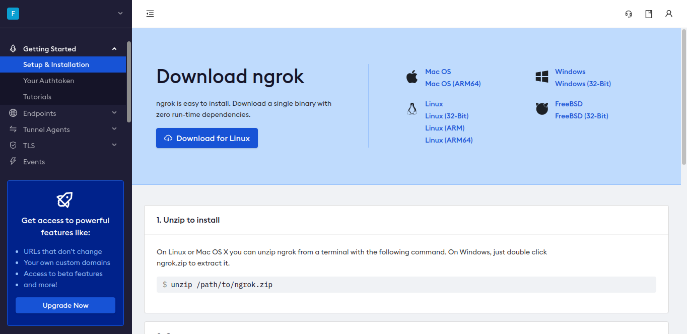
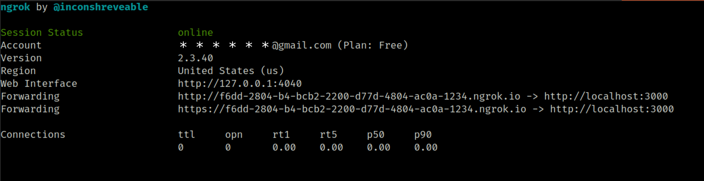
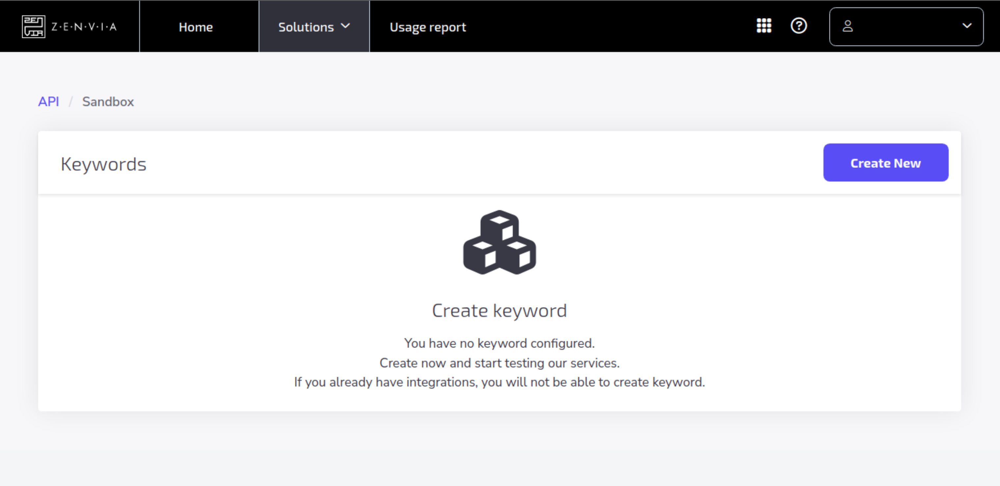

# Chatbot para reconhecimento de músicas
Chatbot construído em Node.js para reconhecimento de músicas no whatsapp. 
<br>
# Ngrok
Para deixar a aplicação acessivel pela internet utilizamos o ngrok. Ele faz o mapeamento da aplicação que esta rodando localmente para um endpoint na internet. Ao enviar uma requisição HTTP:GET para esse endpoint ela sera redirecionada para a porta local no qual a aplicação esta escutando.

Acesse [ngrok](https://ngrok.com/ ) e faça o login.



* Faça download do executavel do ngrok de acordo com seu sistema operacional.


Siga as instruções comforme a página inicial do site <br>

Rode o comando que vai mapear uma porta local para um endpoint exposto na internet:
```shell
$ ./ngrok http 3000
```
<br>
<h3> <b>Resultado Esperado</b> </h3> <br>


A aplicação por padrão estara escutando a porta 3000.<br>
Os dois links gerados serão utilizados na configuração de acesso ao webhook zenvia.
<br/><br/>
# Configuração do webhook na Zenvia

Primeiro acesse [Zenvia Sandbox](https://app.zenvia.com/home/sandbox ) e faça o login.

Se tudo deu certo ate agora voce esta vendo essa tela:


</br></br>

1. Clique em create new


</br>

# Rodando a aplicação localmente

Tenha certeza de ter instalado em sua maquina o docker e o docker-compose

desative o mysql do host
```shell
$ sudo service mysql stop
```
### Rode a aplicação

```shell
$ docker-compose build
$ docker-compose up
```
Em outra aba do terminal abra execute o terminal do container zenvia_app

```shell
$ docker container exec -it <container_id | container_name> /bin/sh
```
Dentro do bash do container execute a migration do prisma para gerar a tabela de usuário no banco:
```shell
$ npx prisma migrate dev create_user
                             ^--- nome da migration
```