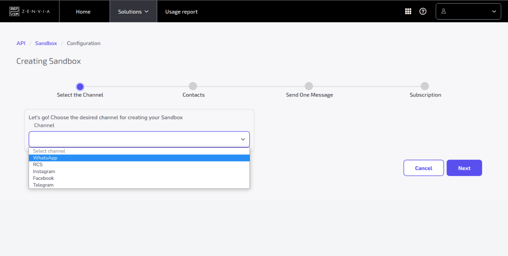

# Chatbot para reconhecimento de músicas
Chatbot construído em Node.js para reconhecimento de músicas no whatsapp. 
<br>
# Ngrok
Para deixar a aplicação acessivel pela internet utilizamos o ngrok. Ele faz o mapeamento da aplicação que esta rodando localmente para um endpoint na internet. Ao enviar uma requisição HTTP:GET para esse endpoint ela sera redirecionada para a porta local no qual a aplicação esta escutando.

Acesse [ngrok](https://ngrok.com/) e faça o login.


* Faça download do executavel do ngrok de acordo com seu sistema operacional.


Siga as instruções comforme a página inicial do site <br>

Rode o comando que vai mapear uma porta local para um endpoint exposto na internet:
```shell
$ ./ngrok http 3000
```
<br>
<h3> <b>Resultado Esperado</b> </h3> <br>


A aplicação por padrão estara escutando a porta 3000.<br>
Os dois links gerados serão utilizados na configuração de acesso ao webhook zenvia.
<br/><br/>
# Configuração do webhook na Zenvia

Primeiro acesse [Zenvia Sandbox](https://app.zenvia.com/home/sandbox ) e faça o login.

Se tudo deu certo ate agora voce esta vendo essa tela:


</br></br>

<h3> 1. Clique em create new </h3><br><br>

</br></br>

<h3> 2. Selecione o canal pelo qual o chatbot vai ser acessado, nesse caso o whatsapp e cique em <b>next</b><h3><br><br>

</br></br>
<h3> 3. Leia o QR Code ou envie a a palavra chave para o numero de teste da zenvia no whatsapp e cique em <b>next</b>. <h3><br><br>

</br></br>

<h3> 3. Ao enviar a palavra chave, uma mensagem de comfirmação é recebida<h3><br><br>

</br></br>

<h3> 4.  Na configuração do sandbox da zenvia, já deve aparecer o número de telefone do usuário que enviou a palavra chave, cique em <b>next</b> para continuar.<h3><br><br>

</br></br>


<h3> 5. Na próxima tela copie o token gerado comforme exibido na imagem, cique em <b>next</b> para continuar.<h3><br><br>

</br></br>

<h3> 6. No arquivo .env na raiz do projeto salve o token na variavel ZENVIA_TOKEN, pronto agora a aplicação esta autorizada a receber e enviar requests para o webhook<h3><br><br>

</br></br>

<h3> 7. Voltando na configuração do webhook zenvia, precisamos configurar o endpoint que sera chamado quando os usuários enviarem uma mensagem para o número de teste da zenvia. Anteriormente, rodamos o comando .ngrok http 3000, esse comando gerou uma url, essa é a url que vamos cadastrar nessa tela.
<br>
Comforme a imagem a seguir, no primeiro campo coloque o endpoint /webhook no final da url, e no segundo coloque /status, cique em <b>finish</b> para finalizar a configuração do webhook.<h3><br><br>

</br></br>

<h3> 8.  Se tudo ocorreu bem vamos ver esta tela  no final e o webhook foi configurado com sucesso.<h3><br><br>

</br></br>

</br>

# Rodando a aplicação localmente

* Tenha certeza de ter instalado em sua maquina o docker e o docker-compose
* Tenha certeza de desativar o banco de dados local, ou qualquer aplicação utilizando a porta 3306. <br>

desative o mysql do host
```shell
$ sudo service mysql stop
```
Execute a aplicação

```shell
$ docker-compose build
$ docker-compose up
```
Em outra aba do terminal abra execute o terminal do container zenvia_app

```shell
$ docker container exec -it <container_id | container_name> /bin/sh
```
Dentro do bash do container execute a migration do prisma para gerar a tabela de usuário no banco:
```shell
$ npx prisma migrate dev create_user
                             ^--- nome da migration
```

Pronto ate aqui sua aplicação já deve esta sendo executada.

# Observações:
Nessa aplicação foram utilizadas as API's do  [Vagalume](https://api.vagalume.com.br/docs/letras/) e [audD](https://audd.io/) tenha certeza de atualizar os tokens das respectivas API's para que a aplicação funcione comforme esperado.

Os novos tokens devem ser setados no arquivo `.env` na raiz do projeto comforme exibido na imagem abaixo

</br></br>

</br></br>

<hr>

Essa aplicação foi desenvolvida com a colaboração de:

[Brian Arruk](https://github.com/Brian-Arruk)

[Luís Felipe](https://github.com/luisfellipe)

[Marcos Andrade](https://github.com/MarcosP-Andrade)

[Ótavio Silva](https://github.com/otaviosilva22)